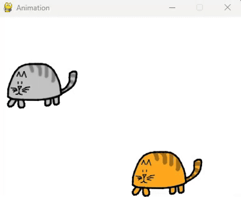
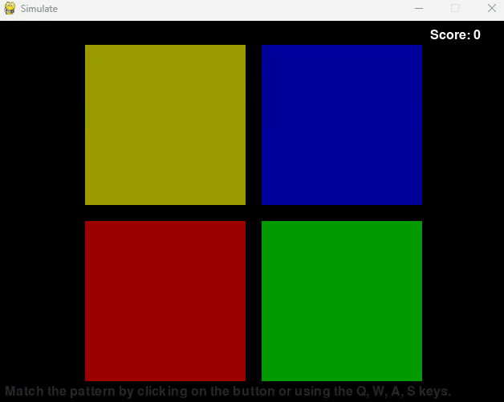
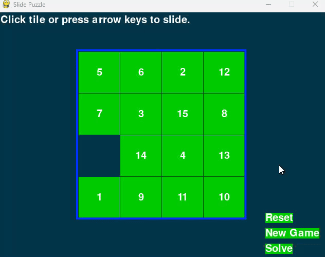
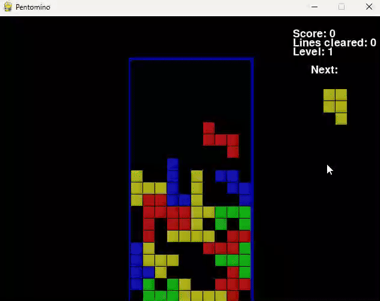

# sgd_2025
Wybrane gry:

· catanimation.py:
Extend the game by adding second cat with different directions. Each cat should move independently and bounce off the edges of the screen
  

· simulate.py:
Add a feature to display a "Game Over" message when the player loses.
  

· slidepuzzle.py:
Add a feature to display the number of moves the player has made during the game in the top-left corner of the screen.
  
  

· pentomino.py:
Add a feature to display the number of lines cleared during the game in the top-right corner of the screen.
  
  

· flippy.py
Add sound effects for placing tiles, flipping tiles, and winning/losing the game.

https://github.com/user-attachments/assets/73087d3e-d82c-49df-a9ad-9c2a232e7ebc

  
https://github.com/user-attachments/assets/562a6779-2833-44ab-9463-7493b97d59b6

· inkspill.py:
Add a feature to display the number of moves the player has made during the game in the top-left corner of the screen.
